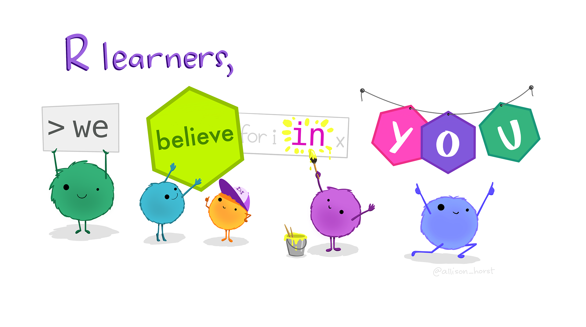

# R introduction: A Beginner's Workshop

(**Artwork by [@allison_horst](https://allisonhorst.com/)**)

This is an `R` workshop for first-time `R` users, and no prior programming experience is required to follow along. The source materials are collected from various sources. We also use a lot of open source data-sets for this workshop, some from `R` packages and some from the wonderful [OpenIntro website](https://www.openintro.org/data/index.php). The OpenIntro webpage is also an excellent source of finding open data sets for different types of data science or statistics course or educational purposes. 

## Set-up, R codes etc.

**First things first, you will need to install R and RStudio.**

Here is an excellent tutorial that takes you step-by-step through this: [https://learnr-examples.shinyapps.io/ex-setup-r/](https://learnr-examples.shinyapps.io/ex-setup-r/)

Once you have both of them installed on your local machine, you are ready to take this tutorial. 

If you want to download the entire set of just the R codes, or the R-markdown files for creating the HTML files or the PDF versions, you can download the entire folder from Github: [https://github.com/DattaHub/BeginneR](https://github.com/DattaHub/BeginneR). Click on the blue "<>Code" button on the top-right corner and click "local" to see the download as zip file option. 

The following topics are covered. 

Part 1:

1.  [What is R?](https://dattahub.github.io/beginneR/01-what-is-R.html)
2.  [Vectors and Data types.](https://dattahub.github.io/beginneR/02-vectors-and-datatypes.html)
3.  [Working with Data frames.](https://dattahub.github.io/beginneR/03-data-frames.html)

Part 2: Tidyverse 

1.  [Data wrangling with dplyr](https://dattahub.github.io/beginneR/05-dplyr.html)
2.  [Visualization with ggplot](https://dattahub.github.io/beginneR/06-data-visualization.html)

Part 3: 

1.  [Dynamic documentation: **R markdown**](https://dattahub.github.io/beginneR/04-packages-and-rmarkdown.html)
2.  [(Very basic) Statistics.](https://dattahub.github.io/beginneR/08-basic-statistics.html)

## Acknowledgment

This was originally a repository for a Beginner's R Workshop that was offered at University of Arkansas when I worked there, and since then this has been replicated and modified a few times. 

The codes are not original or written by me, these are curated from a number of different sources including the excellent tutorials provided by the Ann Arbor R users' group, based on the [Software Carpentry](http://datacarpentry.org), [Rachel's R turorial](https://www.kaggle.com/rtatman/rachael-s-r-tutorials/notebook) and JD's own intro stats teaching materials. 

## More links 

1.  [More open source data-sets](https://vincentarelbundock.github.io/Rdatasets/datasets.html)

2.  [Summarizing data tutorial](https://learnr-examples.shinyapps.io/ex-data-summarise)

